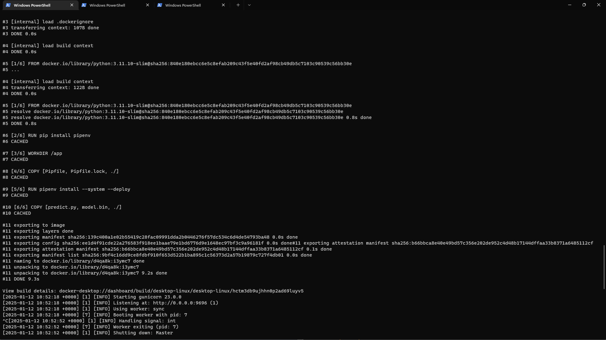
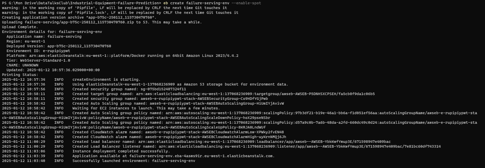
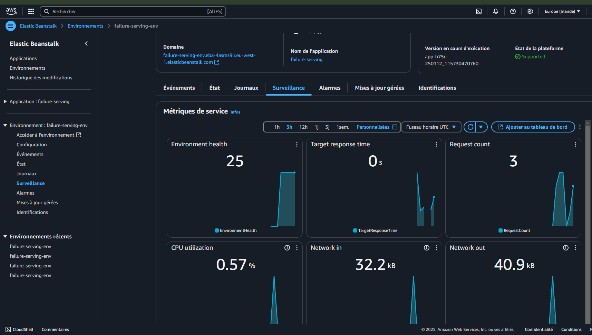

# Industrial Equipment Failure Prediction


---

## Table of Contents
1. [Problem Description](#problem-description)
2. [Data Processing](#data-processing)
3. [Model Training](#model-training)
4. [Deployment](#deployment)
 4.1. [Testing the Service](#testing-the-service)
5. [Dependencies and Environment Setup](#dependencies-and-environment-setup)
6. [Containerization](#containerization)
7. [Cloud Deployment](#cloud-deployment)
 7.1. [Options for Reproducers](#cloud-deployment)
 7.2. [Illustrated Steps for AWS Elastic Beanstalk Deployment](#illustrated-steps-for-aws-elastic-beanstalk-deployment)
8. [Reproducibility](#reproducibility)

---

## Problem Description

This project focuses on predicting industrial equipment failures using machine learning models and deploying the solution as a web service.

## Data Processing

- Exploratory Data Analysis (**EDA**).
- Feature importance analysis.
- Data preprocessing pipeline using **one-hot encoding** for categorical variables.

The dataset includes:
- **Features**: Sensor measurements such as pressure, temperature, rotational speed, etc.
- **Target**: A binary variable indicating whether an equipment failure occurred or not.

## Model Training

The following models were tested:
- Logistic Regression.
- Decision Trees.
- Ensemble Models (Random Forest, XGBoost).

## Deployment

The model is deployed using Flask, providing a REST API to submit data and receive predictions.

### Testing the Service

1. Clone this repository:
   ```bash
   git clone https://github.com/Bruce2Cluny191/Industrial-Equipment-Failure-Prediction.git
   cd Industrial-Equipment-Failure-Prediction
   ```
2. Install dependencies using Pipenv:
   ```bash
   pipenv install
   pipenv shell
   ```
3. Run the Flask service:
   ```bash
   python predict.py
   ```
4. Send a POST request to the `/predict` endpoint with a JSON payload containing equipment features:
- For testing **locally**, use:
   ```bash
   python predict-test.py local
   ```
- For testing with the deployed **AWS environment**, simply run:
   ```bash
   python predict-test.py
   ```
**Recommendation**: Run the testing command multiple times since the machine and its features are selected randomly. This increases the likelihood of observing both result classes (failure and no failure).

## Dependencies and Environment Setup

- Use `pipenv` to manage the environment:
  ```bash
  pipenv install
  pipenv shell
  ```

- Key files:
  - `Pipfile`: Dependency list.
  - `Dockerfile`: For containerization.

## Containerization

A Docker image has been built to simplify deployment. Steps to build and run:
```bash
docker build -t equipment-failure .
docker run -it --rm -p 9696:9696 equipment-failure
```

## Cloud Deployment

The service has been deployed on AWS Elastic Beanstalk and tested with an adapted script:
   ```bash
   python predict-test.py
   ```
### Options for Reproducers
If you would like to test the deployment:

1. Create your own AWS Elastic Beanstalk environment using the provided configuration files and deployment scripts.
2. Alternatively, contact me on [LinkedIn](https://www.linkedin.com/in/chasseur2valeurs/) so I can relaunch the AWS instance for testing purposes.
### Illustrated Steps for AWS Elastic Beanstalk Deployment
1. Elastic Beanstalk local deployment
   - EB init & local run
   ```bash
   eb init -p "Docker running on 64bit Amazon Linux 2023" failure-serving -r eu-west-1
   eb local run --port 9696
   ```
   
   - EB local listening

   
2. Elastic Beanstalk cloud deployment
   - EB create cloud environment
   ```bash
   eb create failure-serving-env --enable-spot
   ``` 
   
   - EB cloud environment monitoring

   
3. Local & cloud testing
   - Local Testing
   ```bash
   python predict-test.py local
   ```
   - Cloud AWS EB Testing
   ```bash
   python predict-test.py
   ``` 
   
   - EB cloud environment terminating
   ```bash
   eb terminate failure-serving-env
   ```
   

## Reproducibility

To reproduce this project:
1. Download the dataset from [Kaggle](https://www.kaggle.com/datasets/dnkumars/industrial-equipment-monitoring-dataset/data) or directly from repository.
2. Explore the data using the `notebook.ipynb` file.
3. Train the model using:
   ```bash
   python train.py
   ```
4. Follow the deployment instructions.